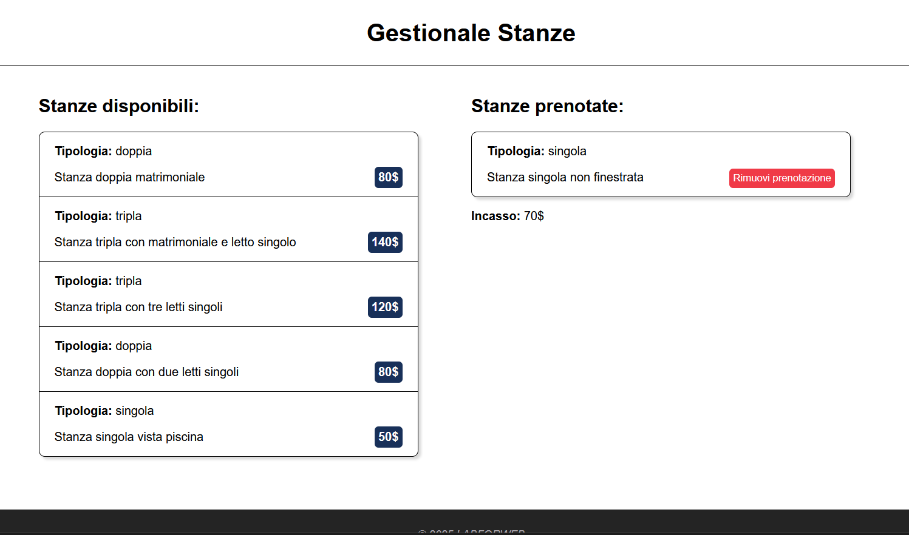
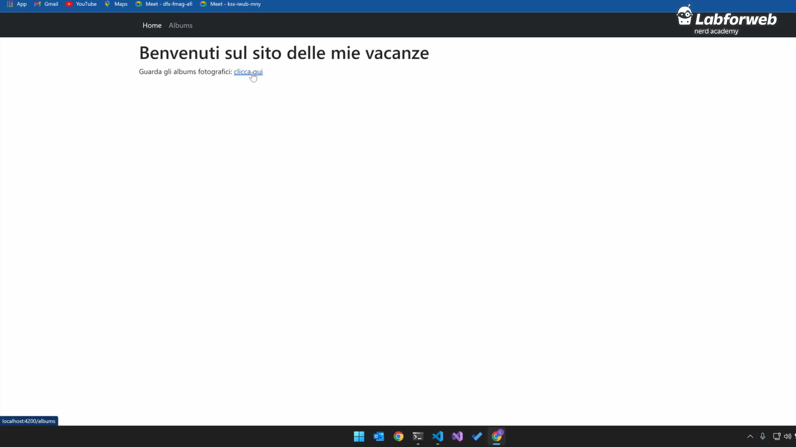
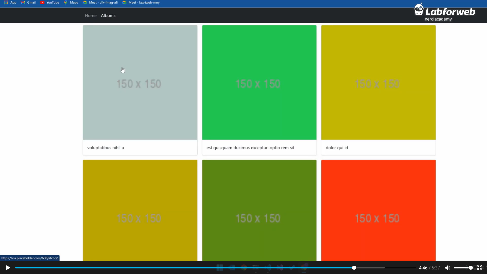
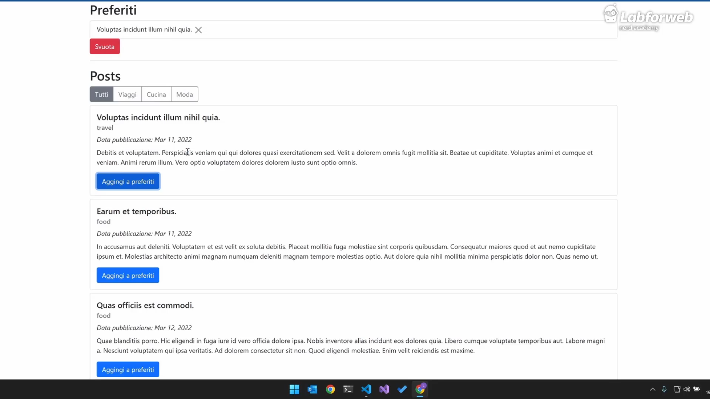

# Installation

To start a local development server, run:

```bash
ng serve
```

Once the server is running, open your browser and navigate to `http://localhost:4200/`. The application will automatically reload whenever you modify any of the source files.

> [!NOTE]
> For every project I used Bootstrap for the CSS Styling of every tag.

> [!ALERT]
> For the third project we need to use JSON Server to create the endpoints to retrieve the posts

To install JSON server we need to run in the terminal, in the root project:

```bash
npm install -D json-server@0 json-server-auth@2
```

to run the REST API Web Server, run:

```bash
json-server --watch 'directory of the json file'
```

at this point we will have the endpoint on port 3000:

```bash
Index:
http://localhost:3000/

Endpoints:
http://localhost:3000/posts
http://localhost:3000/postCategories
```

# Projects

In this repository we have the following projects:

-   1-gestionale-stanze
-   2-routing-ajax
-   3-gestionde-dati-service

## 1-gestionale-stanze

In this project we have a simple Angular application that manages a list of rooms with all the information of each room saved in an Array of objects(room) on `app-component.ts`.

For each room we can reserve it by clicking on the room itself. Once we reserve a room we can see the reservation in the list of reserved rooms. We can also cancel a reservation by clicking on the cancel button.

### Image of the project:



## 2-routing-ajax

In this project we will make HTTP GET calls to the following APIs:

https://jsonplaceholder.typicode.com/

https://jsonplaceholder.typicode.com/albums

https://jsonplaceholder.typicode.com/photos?albumId=numId

In order to make these Calls we need to create a service that will handle the HTTP calls --> `album.service.ts`. We will use the Angular HttpClient to make the calls.

Also we're going to use different components to display the list of albums(`album-list.component.ts`) and each photo of the album(`album-details.component.ts`).

### Home:



### Album list:


### Album details:



> [!NOTE]
> We need to specify the HttpClient() resource on the providers section of `app.module.ts`

<!-- Mettere immagine -->

## 3-gestione-dati-service

In this project we're going to manage a list of posts using a service. We can press the "Aggiungi ai preferiti" button on the post to add it to the favorites section.

For this list we can filter it based to the category of the post:

-   Viaggi (travel)
-   Cucina (food)
-   Moda (fashion)


